# AI Studio

A full-stack AI chat assistant built with **Streamlit**, **Google Gemini**, and **MySQL**. It features user authentication, persistent multi-conversation chat history, streaming responses, file attachments, document generation, and a usage dashboard. This project was built solely as my final internship project.

---

## Table of Contents

- [Features](#features)
- [Tech Stack](#tech-stack)
- [Project Structure](#project-structure)
- [Database Schema](#database-schema)
- [Getting Started](#getting-started)
  - [Prerequisites](#prerequisites)
  - [Installation](#installation)
  - [Environment Variables](#environment-variables)
  - [Database Setup](#database-setup)
  - [Running the App](#running-the-app)
- [Usage Guide](#usage-guide)
- [Error Handling](#error-handling)
- [Known Limitations](#known-limitations)
- [Screenshots](#screenshots)

---

## Features

### Authentication
- Email/password login and registration with client-side and server-side validation
- Passwords are hashed with **bcrypt**. They are never stored in plain text
- Email verification via a one-time password (OTP) on registration
- Forgot-password flow with OTP-based reset
- "Remember me" persistent sessions using JWT tokens stored in an HTTP cookie
- Session is restored automatically on return visits (no re-login required until logout)

### Chat
- Real-time streaming responses from Google Gemini, rendered with a typing effect
- Multiple Gemini models selectable per conversation (Flash, Flash-Lite, Flash Preview variants)
- Full conversation history preserved and replayed into each chat session
- Optional **web search** grounding (Google Search tool) for supported models, with cited sources
- **URL context fetching:** non-YouTube links found in a message are fetched via Gemini's URL context tool, so responses (and auto-generated conversation titles) can be grounded in the actual page content rather than just the raw link text
- **File attachments:** images, video, audio, and PDF. They are sent directly to Gemini as multimodal input
- **YouTube link detection:** links are parsed out of the prompt and sent as native video input, separate from the URL context flow
- Regenerate the last assistant response without losing the rest of the conversation
- Copy-to-clipboard on any assistant message
- **Structured document generation:** it can generate documents (PDF/docx/csc) and send it as a downloadable content to the user, if the user asks for it

### Conversation Management
- Start a new chat, with example prompt cards for quick starts
- Sidebar list of all conversations, grouped into **Pinned** and regular
- Live search/filter across conversation titles, with keyword highlighting
- Rename, pin/unpin, delete, and export conversations from a per-chat context menu
- Export a conversation as **JSON**, **Markdown**, or **plain text**
- Conversations persist across app restarts (stored in MySQL, not just session memory)

### Dashboard
- Live session duration counter (updates every second client-side, no rerun needed)
- Total conversations, total messages, total words
- Messages sent **today** (user / AI / combined)
- Recent conversations list with a quick-open action
- Visual breakdowns via Plotly: sunburst chart (messages/words by role), pie chart (word share), bar chart (sessions vs. messages)

### Settings
- Adjustable generation parameters: temperature, Top-P, Top-K, max output tokens
- Settings persist per user in MySQL and apply live without losing chat history

### Resilience
- Graceful handling of invalid/missing API keys, Gemini API errors, database connection failures, empty input, and duplicate registrations
- The app is designed to degrade gracefully (toast/error message) rather than crash

---

## Tech Stack

| Layer | Technology |
|---|---|
| UI framework | [Streamlit](https://streamlit.io/) (multi-page via `st.navigation`) |
| AI model | [Google Gemini](https://ai.google.dev/) via `google-genai` SDK |
| Database | MySQL (via `mysql-connector-python`, connection pooling) |
| Auth | JWT (`PyJWT`) + `bcrypt` password hashing + `streamlit-cookies-controller` / `st.context.cookies` |
| Email | `redmail` (SMTP) for OTP delivery |
| Documents | `xhtml2pdf` (PDF), `python-docx` + `htmldocx` (Word), `pandas` (CSV) |
| Charts | `plotly` |
| Data models | `pydantic` (structured Gemini output), `TypedDict` (internal typing) |
| Linting/formatting | `ruff` (dev-only, see [Installation](#installation)) |

---

## Project Structure

```
├── main.py                    # App bootstrap: session init, auth check, page navigation
├── pages/
│   ├── login.py
│   ├── verify.py
│   ├── new_chat.py
│   ├── chat.py
│   ├── dashboard.py
│   └── settings.py
├── core/
│   ├── config.py               # Env vars, constants, DEFAULTS, load_config()
│   ├── database.py             # Database class — all MySQL queries
│   ├── chatbot.py              # Gemini chat/session/title generation, URL context wiring
│   ├── mailer.py                # OTP email sending
│   └── models/                 # TypedDicts & Pydantic models
├── auth/
│   ├── service.py               # cookie_controller, set_auth_cookie, logout
│   ├── tokens.py                 # JWT create/decode
│   └── passwords.py              # hash/validate password
├── assets/
│   ├── css/                    # CSS constants, one file per UI area
│   │   ├── sidebar.py
│   │   ├── message.py
│   │   ├── dialogs.py
│   │   ├── auth.py
│   │   ├── dock.py
│   │   └── dashboard.py
│   └── js/                     # JS constants, one file per UI area
│       ├── menu.py
│       ├── profile.py
│       ├── dialogs.py
│       ├── auth.py
│       ├── chat_input.py
│       └── dashboard.py
├── prompts/
│   └── instructions.py          # System instructions for document assistant & title generation
├── services/
│   ├── export_service.py        # JSON/Markdown/Text export builders
│   ├── document_service.py      # PDF/DOCX/CSV generation
│   ├── chat_service.py           # update_chat, sync_config, on_model_change, bump_chat_to_top
│   └── streaming_service.py      # stream_chat_response, source extraction, response parsing
├── ui/
│   ├── sidebar.py                # Conversation list rendering
│   ├── profile.py                 # User profile card & menu
│   ├── dialogs.py                  # Rename/delete/export/sources/preview dialogs
│   ├── model_controls.py           # Model selector, web search toggle
│   └── message_render.py           # Message bubbles, attachments, copy button, document cards
└── utils/
    ├── text.py                    # count_words, highlight, timestamps, duration formatting
    ├── files.py                    # Attachment handling, multimodal message parts
    ├── serialization.py             # History encode/decode for DB storage
    ├── ids.py                       # Conversation ID generation
    └── clipboard.py                 # Copy-to-clipboard / menu-close iframe HTML
```

---

## Database Schema

Database name: **`ai_studio_db`** (UTF-8 `utf8mb4` / `utf8mb4_unicode_ci`, InnoDB engine throughout). The full creation script, with all constraints and indexes, is provided in [`schema.sql`](schema.sql).

### `users`
| Column | Type | Notes |
|---|---|---|
| `id` | BIGINT UNSIGNED, PK, AUTO_INCREMENT | |
| `full_name` | VARCHAR(255) | |
| `email` | VARCHAR(255), **UNIQUE** (`uq_users_email`) | |
| `password_hash` | VARCHAR(255) | bcrypt hash |
| `model` | VARCHAR(100), default `gemini-3.1-flash-lite` | |
| `temperature` | FLOAT, default `0.1` | |
| `max_output_tokens` | INT UNSIGNED, default `2048` | |
| `top_p` | FLOAT, default `0.95` | |
| `top_k` | INT UNSIGNED, default `64` | |
| `web_search` | BOOLEAN, default `FALSE` | |
| `is_active` | BOOLEAN, default `TRUE` | |
| `email_verified_at` | DATETIME, NULLABLE | |
| `last_login_at` | DATETIME, NULLABLE | Used as the dashboard's session start time |
| `created_at` | DATETIME, default `CURRENT_TIMESTAMP` | |
| `updated_at` | DATETIME, auto-updates on row change | |

### `conversations`
| Column | Type | Notes |
|---|---|---|
| `id` | VARCHAR(100), PK | Custom generated ID (base36 timestamp + UUID hex) |
| `user_id` | BIGINT UNSIGNED, **FK → `users.id`**, `ON DELETE CASCADE` | |
| `title` | VARCHAR(500), default `'New chat'` | Auto-generated from the first message |
| `model` | VARCHAR(100), NULLABLE | |
| `is_pinned` | BOOLEAN, default `FALSE` | |
| `pinned_at` | DATETIME, NULLABLE | Used to order pinned chats |
| `message_count` | INT UNSIGNED, default `0` | Denormalized counter |
| `word_count` | INT UNSIGNED, default `0` | Denormalized counter |
| `created_at` | DATETIME, default `CURRENT_TIMESTAMP` | |
| `updated_at` | DATETIME, auto-updates on row change | Drives sidebar chat ordering |

Indexes: `idx_conversations_user_id`, `idx_conversations_user_pinned (user_id, is_pinned)`, `idx_conversations_user_updated (user_id, updated_at)`.

### `messages`
| Column | Type | Notes |
|---|---|---|
| `id` | BIGINT UNSIGNED, PK, AUTO_INCREMENT | |
| `conversation_id` | VARCHAR(100), **FK → `conversations.id`**, `ON DELETE CASCADE` | |
| `role` | ENUM(`'user'`, `'assistant'`) | |
| `message` | MEDIUMTEXT | |
| `raw_parts` | JSON, NULLABLE | Serialized Gemini `Content` history, used to resume a session |
| `created_at` | DATETIME, default `CURRENT_TIMESTAMP` | |

Indexes: `idx_messages_conversation_id`, `idx_messages_conversation_created (conversation_id, created_at)`.

### `message_attachments`
| Column | Type | Notes |
|---|---|---|
| `id` | BIGINT UNSIGNED, PK, AUTO_INCREMENT | |
| `message_id` | BIGINT UNSIGNED, **FK → `messages.id`**, `ON DELETE CASCADE` | |
| `name` | VARCHAR(255) | |
| `mime_type` | VARCHAR(127) | |
| `size` | INT UNSIGNED | |
| `available` | BOOLEAN, default `TRUE` | Marks attachments that failed to restore on reload |
| `data` | LONGBLOB, NULLABLE | Raw file bytes |
| `created_at` | DATETIME, default `CURRENT_TIMESTAMP` | |

Index: `idx_attachments_message_id`.

### `message_sources`
| Column | Type | Notes |
|---|---|---|
| `id` | BIGINT UNSIGNED, PK, AUTO_INCREMENT | |
| `message_id` | BIGINT UNSIGNED, **FK → `messages.id`**, `ON DELETE CASCADE` | |
| `uri` | VARCHAR(2048) | |
| `title` | VARCHAR(500) | |

Index: `idx_sources_message_id`. Populated from Gemini web-search grounding metadata.

> All foreign keys cascade on delete — removing a user removes their conversations, which in turn removes their messages, attachments, and sources automatically. There is currently no dedicated `sessions` table; JWT-based auth is stateless (no server-side revocation list).

---

## Getting Started

### Prerequisites

- Python 3.11+
- MySQL 8.x (or compatible) — this can be a standalone MySQL install, or the MySQL/MariaDB bundled with **XAMPP**
- A Google Gemini API key ([Google AI Studio](https://aistudio.google.com/))
- SMTP credentials for sending OTP emails (e.g. Gmail App Password, SendGrid, Mailgun)

### Installation

```bash
pip install -r requirements.txt
```

Dev-only tooling (currently just `ruff` for linting/formatting) lives in a separate `requirements-dev.txt`, so it isn't installed in production:

```bash
git clone https://github.com/LuckyYam/ai-studio.git
cd ai_studio
pip install -r requirements-dev.txt
```

Once installed, run `ruff` from the project root:

```bash
ruff format .     # auto-format the codebase
ruff check .      # lint
ruff check . --fix  # lint and auto-fix what it can
```

### Environment Variables

Create a `.env` file in the project root:

```env
GEMINI_API_KEY=your_google_gemini_api_key
JWT_SECRET=a_long_random_secret_string
```

Create `.streamlit/secrets.toml` for database and email credentials:

```toml
[mysql]
host = "localhost"
port = 3306
user = "root"
password = "your_mysql_password"
database = "ai_studio_db"

[smtp]
host = "smtp.gmail.com"
port = 587
username = "your_email@gmail.com"
password = "your_app_password"
sender = "your_email@gmail.com"
```

### Database Setup

`schema.sql` creates the database itself (`ai_studio_db`), so there's no need to create it manually first.

#### Option A: Standard MySQL install

```bash
mysql -u root -p < schema.sql
```

Update `secrets.toml`'s `[mysql]` block so that `database = "ai_studio_db"` (matching the name the script creates), and set `user`/`password` to your MySQL credentials.

#### Option B: XAMPP

XAMPP ships its own MySQL (MariaDB) server, usually running on port `3306` with the default user `root` and **no password**.

1. Open the **XAMPP Control Panel** and start the **MySQL** module (and **Apache**, if you plan to use phpMyAdmin).
2. Import the schema using either method below:
   - **phpMyAdmin** (easiest): go to `http://localhost/phpmyadmin`, click **Import**, choose `schema.sql`, and click **Go**. This creates the `ai_studio_db` database and all its tables.
   - **Command line**: run the `mysql` binary from your XAMPP install instead of a system-wide one, since XAMPP's MySQL usually isn't on your `PATH` by default.
     - Windows: `C:\xampp\mysql\bin\mysql.exe -u root < schema.sql`
     - macOS: `/Applications/XAMPP/xamppfiles/bin/mysql -u root < schema.sql`
     - Linux: `/opt/lampp/bin/mysql -u root < schema.sql`
3. Update `.streamlit/secrets.toml` to match XAMPP's defaults:

   ```toml
   [mysql]
   host = "localhost"
   port = 3306
   user = "root"
   password = ""
   database = "ai_studio_db"
   ```

   If you've set a root password in XAMPP's MySQL/phpMyAdmin config, use that instead of an empty string.

### Running the App

```bash
streamlit run main.py
```

The app will be available at `http://localhost:8501`.

---

## Usage Guide

1. **Register** a new account — you'll receive an OTP by email to verify it.
2. **Log in** — check "Remember me" for a 30-day persistent session, otherwise sessions expire after 1 day.
3. From **New Chat**, either pick an example prompt or type your own — optionally attach files or toggle **Web Search** first.
4. Once in a conversation, continue chatting, **regenerate** the last response, or open the **⋮ menu** on any sidebar chat to rename, pin, export, or delete it.
5. Visit **Dashboard** for usage stats, or **Settings** to tune generation parameters (temperature, Top-P, Top-K, max tokens) — these apply live without erasing history.
6. **Log out** from the profile card in the sidebar footer when done.

---

## Error Handling

The app is designed to fail gracefully rather than crash:

| Scenario | Behavior |
|---|---|
| Invalid login credentials | Inline form error, no page reload |
| Duplicate email registration | Inline form error before any DB write |
| Empty chat input | `st.chat_input` blocks submission of an empty/whitespace-only message with no files |
| Missing/invalid Gemini API key | Caught at client construction and at each API call; shown as a toast/error, app remains usable |
| Gemini API errors (rate limit, model errors, etc.) | Caught per call, surfaced via `st.error`/`st.toast`, conversation state is not corrupted |
| MySQL connection/query failures | Caught in the `Database` class, raised as `RuntimeError` and surfaced to the user without a stack trace |
| Unavailable attachments after DB reload | Marked `available: False` and shown with a "no longer available" indicator instead of breaking the message |

---

## Known Limitations

- Structured document generation (PDF/DOCX/CSV) requires the model to route through a JSON-mode system instruction, which is disabled while Web Search is active. Gemini 2.x models don't support tool use (Google Search, URL context) and structured JSON output in the same request, so on those models tools are only passed to the API when Web Search is explicitly toggled on, and structured document generation is unavailable for the rest of that session. Gemini 3 models don't have this restriction, so URL context stays available alongside structured output regardless of the Web Search toggle.
- Occasionally, Web Search-grounded responses may return empty text while grounding metadata is still populated. I highly suspect this is because of the limited max output tokens.
- `streamlit-cookies-controller` is retained as a fallback for environments without `st.context.cookies`; on the very first script run, its internal cache may be unhydrated, which is handled defensively but is a known quirk of the library.
- Web search grounding are only available on Gemini 2.x model variants (since mine is free tier 🥹).

---

## Screenshots

### Authentication & User Management
* **Login:** User authentication interface to securely access the platform.
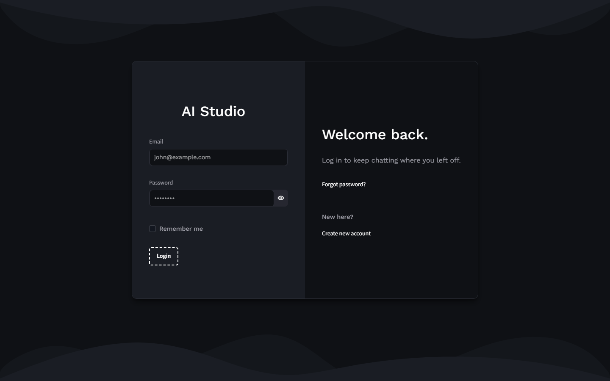
* **Register:** Account creation interface for new users requiring full name, email, and password confirmation.
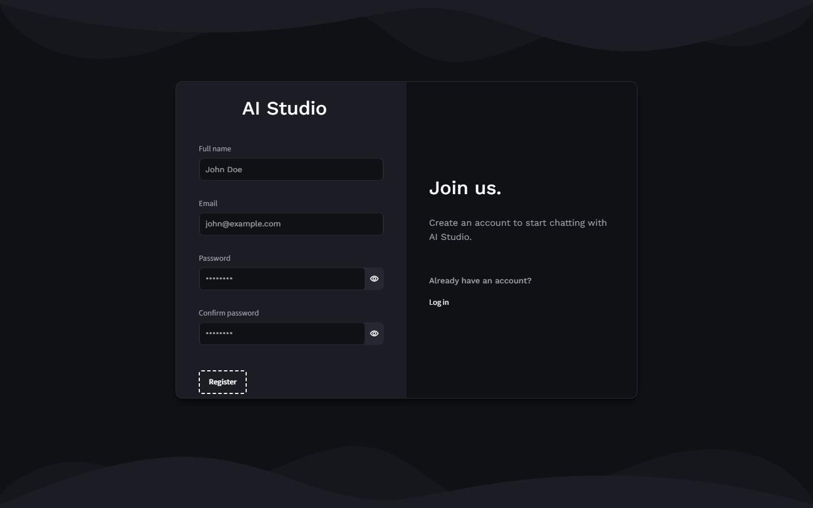
* **Forgot Password:** Password recovery screen featuring email input to initiate the reset process.
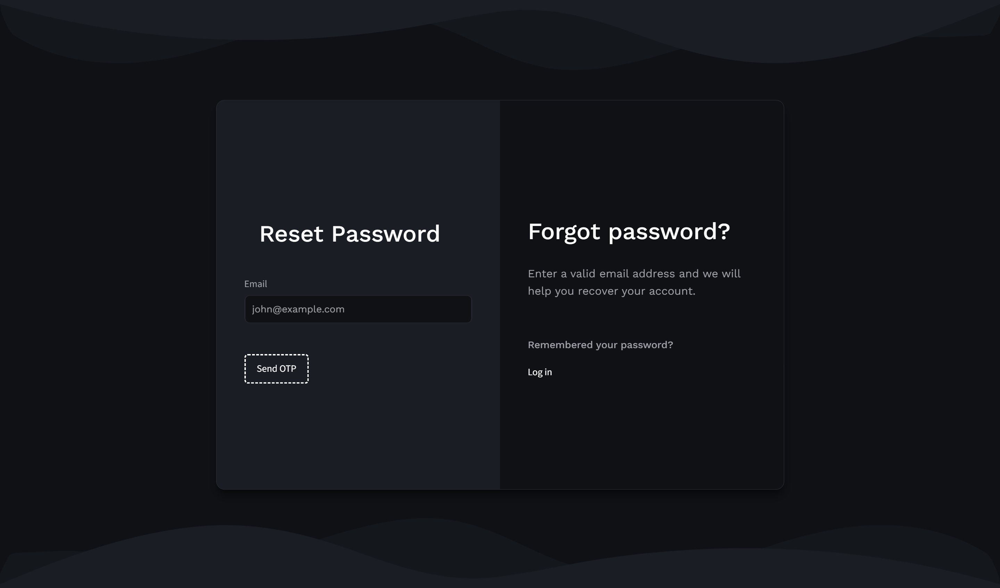
* **Verify:** OTP verification screen instructing users to enter the one-time passcode sent to their inbox.
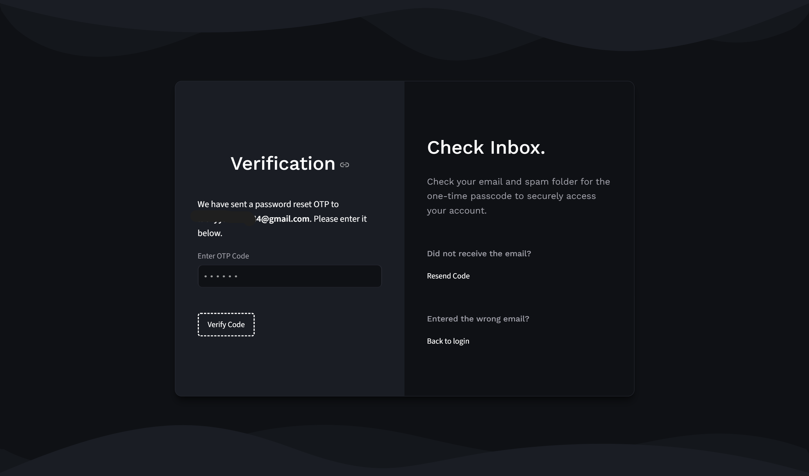
* **Logout:** User profile pop-up menu at the bottom of the sidebar providing the option to securely log out of the active session.
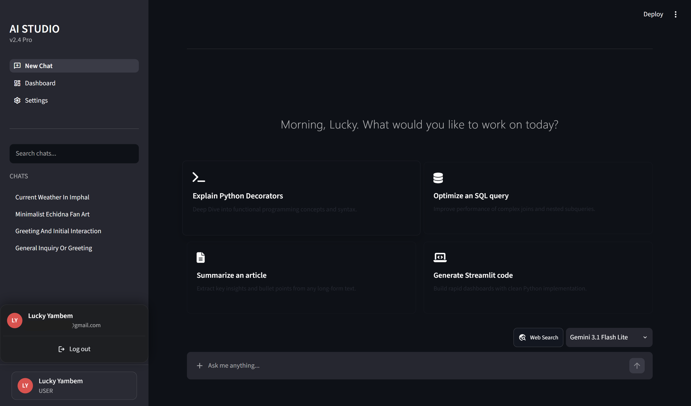

### Chat Interface
* **New Chat:** The default state for initiating a new session, featuring a personalized user greeting and categorized quick-start prompt cards.
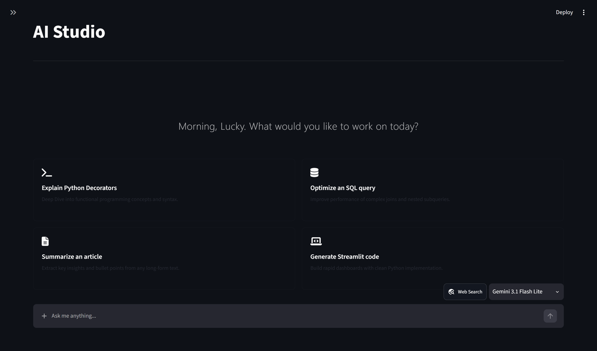
* **Chat:** Active conversation view displaying AI-generated text and visual media.
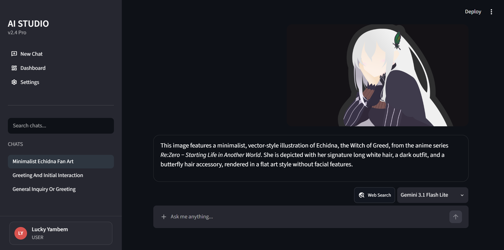
* **Conversation Search:** Sidebar search functionality allowing users to filter and quickly locate specific past chat histories.
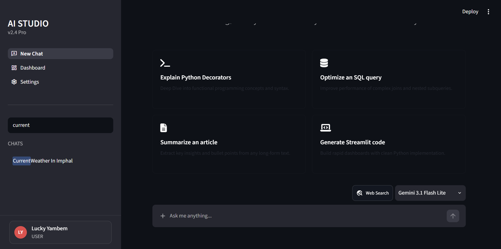
* **Web Search:** Chat interface showcasing responses generated with live web search integration for up-to-date information.
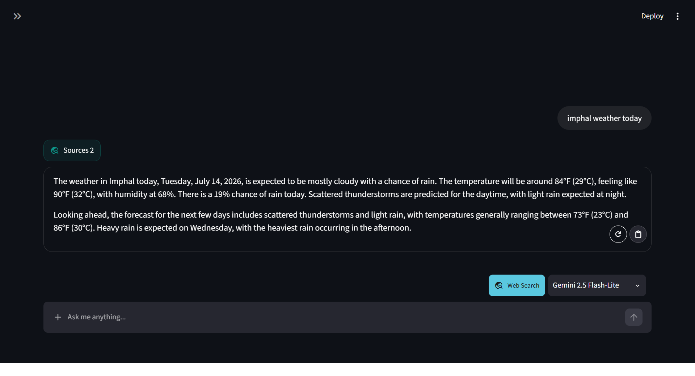
* **Web Search Sources:** A dialog overlay revealing the specific external links and domain references used to ground the web-searched response.
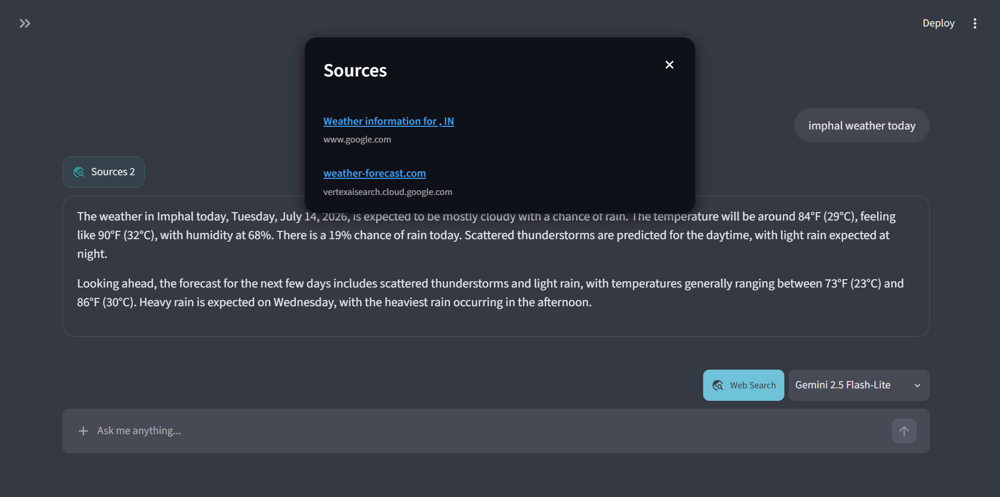

### Chat Management
* **Chat Options:** A context menu providing quick actions to Pin, Rename, Export, or Delete a selected chat session.
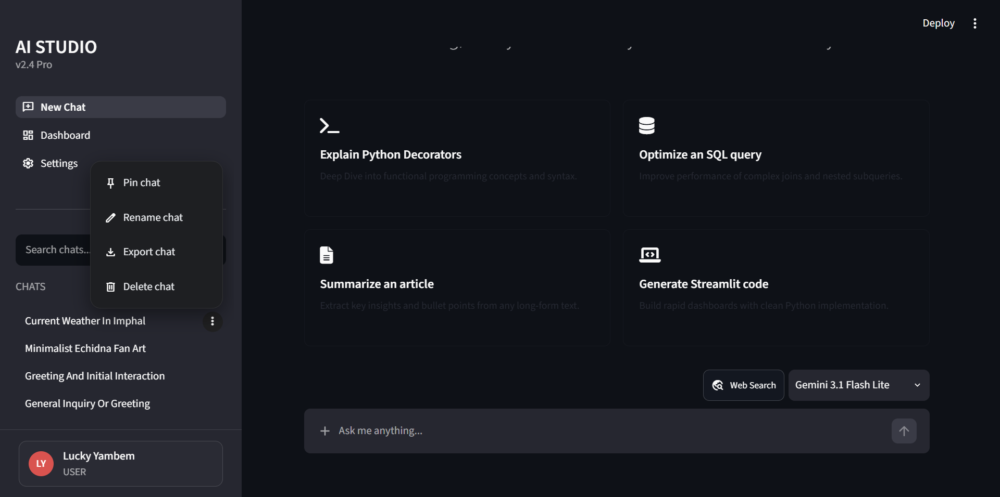
* **Rename Chat:** A prompt window to customize and update the title of an existing conversation.
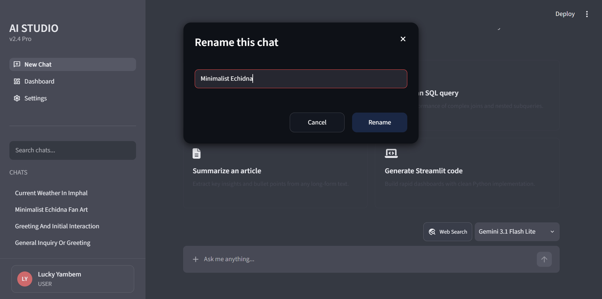
* **Export Chat:** A tool to download and save conversation transcripts in formatted JSON, Markdown, or Plain Text.
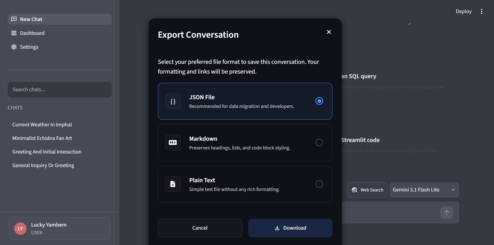
* **Delete Chat:** A confirmation dialog to prevent the accidental deletion of chat records.
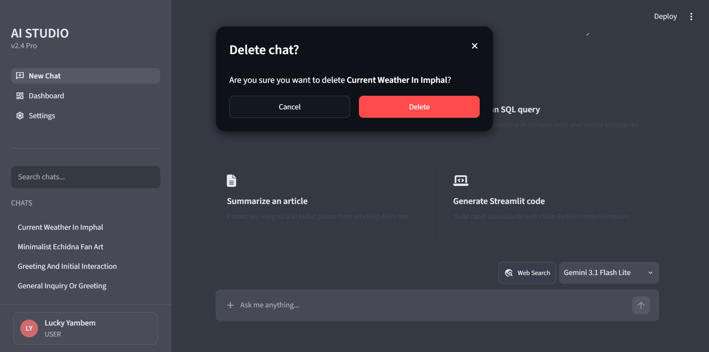

### Analytics
* **Dashboard:** A comprehensive overview panel featuring usage statistics, recent conversation logs, and graphical distributions of user versus AI messaging metrics.
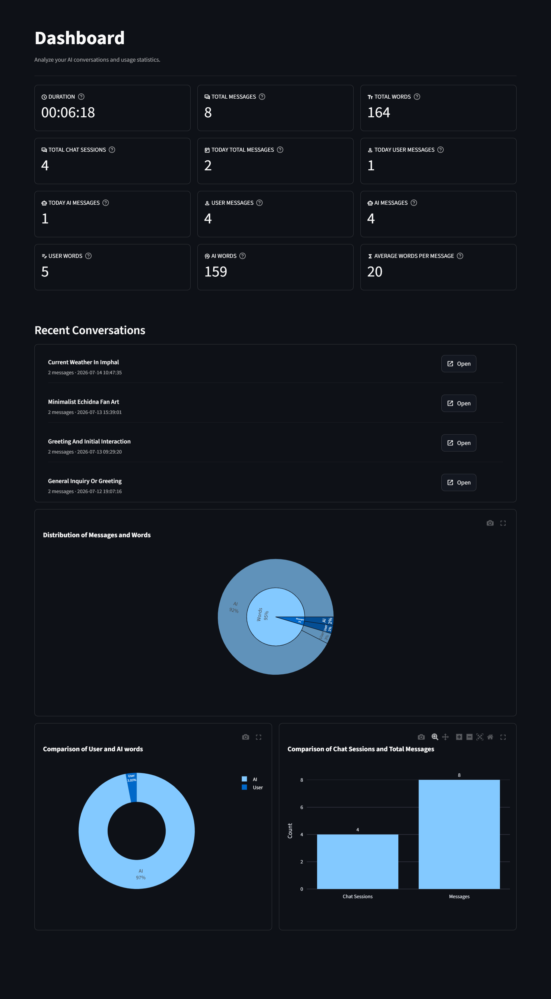